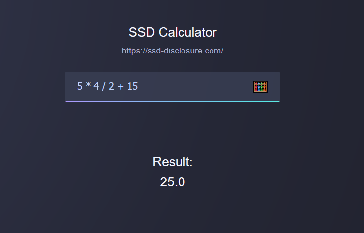

# Lil Bits 9: RCE - Calculator

## Setup
Install required modules
- `pip install -r requirements.txt`
Run Flask app
- `flask run`
Enjoy!

## Result
The resulting page should look something like this

